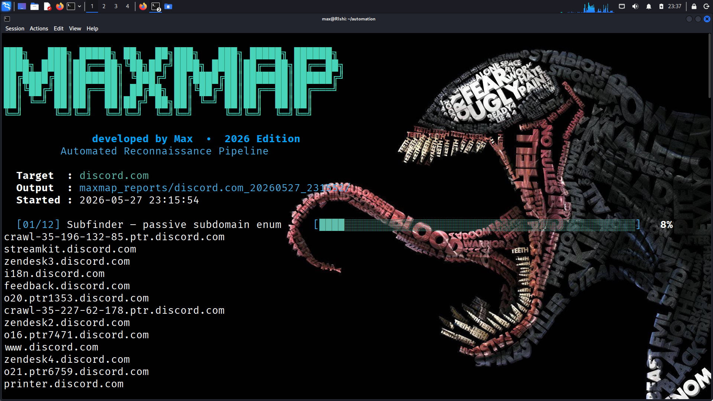
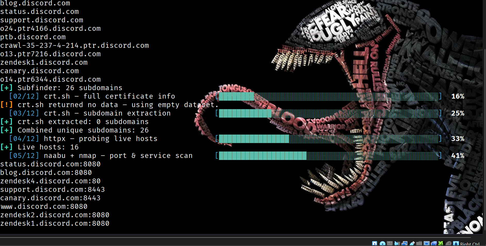
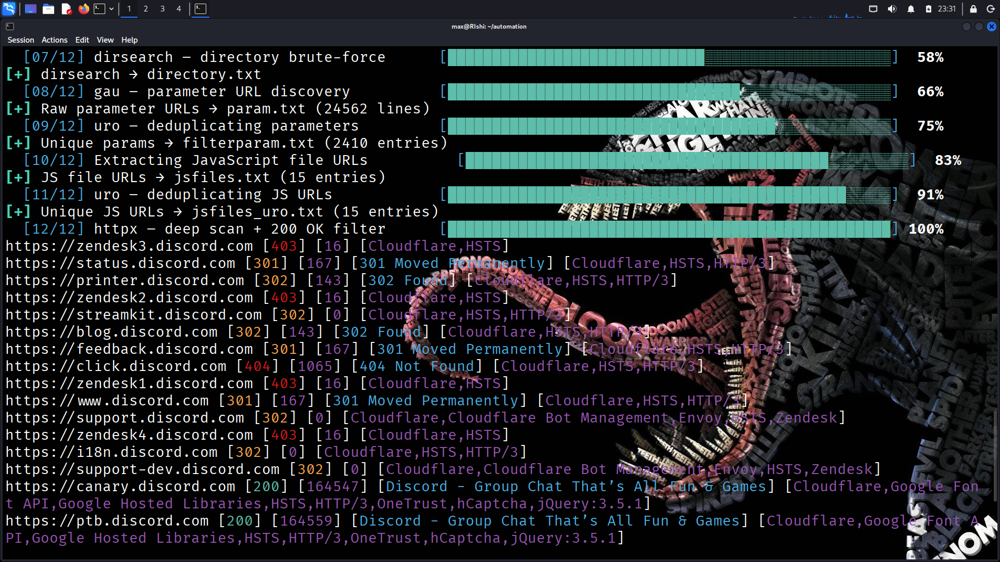
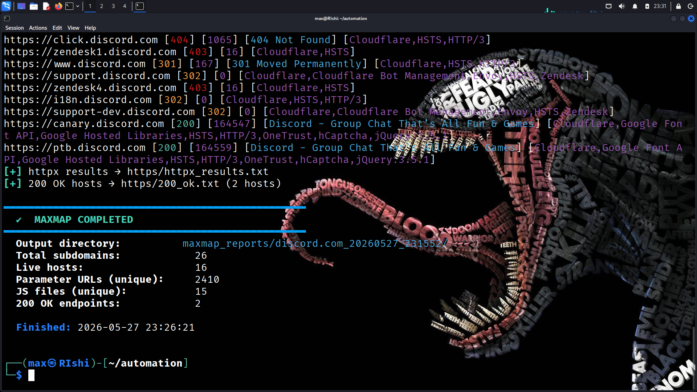

# MAXMAP — Automated Reconnaissance Pipeline

<p align="center">
  
  
  
  
  
</p>

<p align="center">
  
</p>

<p align="center">
  <b>Industrial-grade reconnaissance automation for modern attack surface discovery.</b>
</p>

---

# MAXMAP

MAXMAP is a high-performance reconnaissance framework engineered for:

* bug bounty hunters
* red team operators
* pentesters
* OSINT researchers
* offensive security workflows

The framework automates the complete early-stage recon pipeline and transforms raw target data into structured intelligence ready for enumeration, fuzzing, exploitation, and attack surface analysis.

No bloated setup.
No fragmented tooling.
No manually chaining recon utilities for hours.

Just one command.
One target.
Full reconnaissance pipeline.

---

# Why MAXMAP Exists

Modern reconnaissance is noisy.

Hunters waste time:

* switching between tools
* cleaning duplicate output
* fixing broken pipelines
* organizing recon data manually
* dealing with unstable scripts

MAXMAP solves that problem.

It combines industry-standard reconnaissance tooling into one stable offensive pipeline with:

* automated dependency management
* structured reporting
* intelligent filtering
* live host discovery
* endpoint harvesting
* JavaScript intelligence extraction
* parameter mining
* response analysis

Designed for speed.
Built for long recon sessions.
Optimized for real-world offensive operations.

---

# Recon Pipeline

```text
Passive Enumeration
        ↓
Certificate Transparency Intelligence
        ↓
DNS Resolution
        ↓
Live Host Detection
        ↓
Port Discovery
        ↓
Directory Enumeration
        ↓
Historical URL Harvesting
        ↓
JavaScript Intelligence Extraction
        ↓
Parameter Mining
        ↓
HTTP Response Analysis
        ↓
Structured Recon Reports
```

---

# Core Features

## Passive Subdomain Enumeration

Combines:

* Subfinder
* crt.sh intelligence scraping

to maximize subdomain discovery coverage.

---

## DNS Resolution Engine

Uses:

* PureDNS
* High-performance resolver lists

for clean and reliable DNS validation.

---

## Live Host Intelligence

HTTP probing powered by:

* Httpx

Automatically identifies:

* alive domains
* active web services
* reachable attack surfaces

---

## Port Discovery

Fast TCP port scanning using:

* Naabu

Optimized for:

* high-speed reconnaissance
* low interruption scanning

---

## Endpoint Harvesting

Historical URL collection using:

* GAU

Finds:

* archived endpoints
* hidden parameters
* forgotten routes
* historical attack surfaces

---

## JavaScript Intelligence Extraction

Automatically extracts:

* JavaScript endpoints
* bundled JS files
* optimized assets
* frontend intelligence

Perfect for:

* secret hunting
* API discovery
* hidden endpoint enumeration

---

## Parameter Mining

Filters and extracts:

* GET parameters
* dynamic endpoints
* injectable-looking URLs

Useful for:

* XSS
* IDOR
* SQLi
* SSRF
* Open Redirect testing

---

## Directory Bruteforcing

Integrated:

* Dirsearch automation

for rapid content discovery on live targets.

---

## HTTP Response Classification

Automatically categorizes:

* 200 responses
* redirects
* forbidden endpoints
* error pages

into organized status-code reports.

---

# Framework Architecture

```text
MAXMAP
│
├── Passive Enumeration
├── DNS Resolution
├── HTTP Probing
├── Port Scanning
├── Directory Discovery
├── URL Harvesting
├── JavaScript Extraction
├── Parameter Mining
├── Response Classification
└── Structured Reporting
```

---

# Screenshots

## Framework Banner

<p align="center">
  
</p>

---

## Recon Pipeline Execution

<p align="center">
  
</p>

---

## Enumeration & Discovery

<p align="center">
  
</p>

---

## Final Recon Output

<p align="center">
  
</p>

---

# Installation

## Clone Repository

```bash
git clone https://github.com/IssanPy/MAXMAP.git
cd MAXMAP
chmod +x maxmap.sh
```

---

# Usage

```bash
./maxmap.sh example.com
```

Example:

```bash
./maxmap.sh tesla.com
```

---

# Output Structure

```text
maxmap_reports/<domain>_<timestamp>/
│
├── subdomains.txt
├── resolved.txt
├── alive_urls.txt
├── alive_hosts.txt
├── ports.txt
├── all_urls.txt
├── jsfiles_unique.txt
├── params_raw.txt
├── filterparam.txt
├── dir_results.txt
│
└── https/
    ├── httpx_full.txt
    └── status_codes/
        ├── 200.txt
        ├── 301.txt
        ├── 403.txt
        └── 500.txt
```

---

# Dependencies

MAXMAP automatically installs missing dependencies.

## System Packages

* nmap
* jq
* curl
* git
* pip3
* pipx
* massdns

---

## Go Toolchain

* subfinder
* httpx
* naabu
* gau
* anew
* puredns

---

## Python Utilities

* uro
* dirsearch

---

# Performance Characteristics

* Parallelized reconnaissance
* Timeout protection
* Automatic dependency installation
* Clean output organization
* Fast DNS resolution
* Reduced duplicate data
* Stable execution flow
* Optimized for long recon sessions

---

# Example Recon Results

Example execution against a live target generated:

* live hosts
* archived URLs
* JavaScript assets
* parameterized endpoints
* status code intelligence
* historical routes
* frontend assets
* attack surface mapping data

All automatically categorized into structured reports.

---

# Use Cases

* Bug Bounty Reconnaissance
* Red Team Operations
* External Attack Surface Mapping
* VAPT Automation
* Web Enumeration
* Endpoint Discovery
* Asset Intelligence Gathering
* Parameter Discovery
* JavaScript Recon
* Initial Target Profiling

---

# Legal Disclaimer

This framework is intended strictly for:

* authorized security testing
* educational research
* legal reconnaissance operations

Unauthorized use against systems you do not own or have permission to test may violate laws and regulations.

The developer assumes no liability for misuse.

---

# Contributing

Pull requests, improvements, and offensive feature ideas are welcome.

To contribute:

```bash
1. Fork the repository
2. Create a feature branch
3. Commit changes
4. Push updates
5. Open a pull request
```

---

# License

MIT License © Max

---

# Developer

<p align="center">
  <b>MAX • 2026 Edition</b><br>
  Offensive Security • Recon Automation • Attack Surface Intelligence
</p>

<p align="center">
  <i>"The quieter the recon, the louder the impact."</i>
</p>
